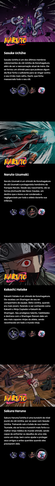

[![MIT License][license-shield]][license-url]
[![Version][version-shield]][version-shield]

 

    
     
     

  <h3 align="center">Projeto Naruto</h3>

  

    Landing Page simples apresentando os personagens da obra Naruto.
     
    <a target="_blank" href="https://joaosouza7.github.io/naruto-project/"><strong>Explore o site »</strong></a>
     
     
    <a href="#sobre">Sobre</a> •
    <a href="#tecnologias">Tecnologias</a> • 
    <a href="#preview">Preview</a> • 
    <a href="#licenca">Licença</a> •
    <a href="#contato">Contato</a>
  

<!--Sobre o Projeto-->
<h2 id="sobre">💻 Sobre o projeto</h2>

Esse projeto consiste na criação de uma landing page exibindo os personagens da obra Naruto, desenvolvido durante a **Semana do Zero ao Programador Contratado** promovido pela [DevEmDobro][devemdobro].

Neste evento é ensinado aos participantes os pilares e melhores práticas do **Desenvolvimento Front-end**, em paralelo ao desenvolvimento do projeto.

<!--Tecnologias-->
<h2 id="tecnologias">🛠 Tecnologias utilizadas</h2>

As seguintes ferramentas foram utilizadas no desenvolvimento do projeto.

-   [HTML][html]
-   [CSS][css]
-   [JavaScript][javascript]

<!--Preview do projeto-->
<h2 id="preview">🔎 Preview do projeto</h2>

### 🌐 Web

### 📱 Mobile

<!--Licença-->
<h2 id="licenca">📝 Licença</h2>

Esse projeto está sob a licença [MIT][license-url].

Veja o arquivo `LICENSE` para mais detalhes.

<!--Contato-->
<h2 id="contato">✉️ Contato</h2>

João Souza - [Linkedin](https://www.linkedin.com/in/joao-souza07/) - joaoosouza07@gmail.com

Portfólio - https://portfolio-joaosouza7.vercel.app/

(<a href="#readme-top">🔝 Voltar ao topo</a> )

<!-- LINKS E IMAGENS -->

[license-shield]: https://img.shields.io/badge/LICENSE-MIT-green?style=for-the-badge
[license-url]: ./LICENSE
[version-shield]: https://img.shields.io/badge/VERSION-1.0.0-dc3545?style=for-the-badge
[html]: https://developer.mozilla.org/pt-BR/docs/Web/HTML
[css]: https://developer.mozilla.org/pt-BR/docs/Web/CSS
[javascript]: https://developer.mozilla.org/pt-BR/docs/Web/JavaScript
[devemdobro]: https://www.youtube.com/c/devemdobro
